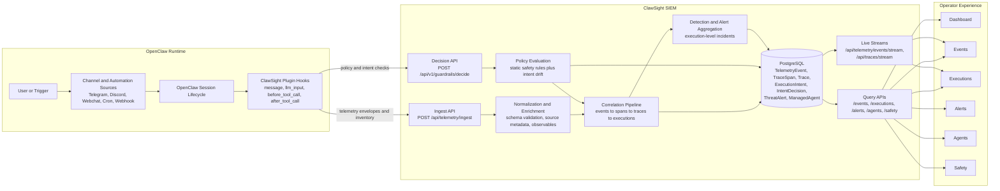

<p align="center">
  <h1 align="center">ClawSight SIEM</h1>
  <p align="center"><strong>Execution-first security and observability for autonomous AI agents.</strong></p>
  <p align="center"><em>Ingest. Correlate. Enforce. Investigate.</em></p>
</p>

<p align="center">
  
  
  
  
  
  
</p>

---

<p align="center">
  <a href="#quick-start">Quick start</a> &middot;
  <a href="#required-configuration">Configuration</a> &middot;
  <a href="#openclaw-plugin-wiring">Plugin wiring</a> &middot;
  <a href="#product-surfaces">Product surfaces</a> &middot;
  <a href="#intent-based-policy-architecture">Intent policy</a> &middot;
  <a href="#api-overview">API</a>
</p>

<p align="center">
  <a href="docs/overview.md">SIEM Overview</a> &middot;
  <a href="docs/architecture.md">Architecture</a> &middot;
  <a href="docs/setup.md">Setup</a> &middot;
  <a href="docs/safety_policy.md">Safety Policy</a> &middot;
  <a href="docs/intent_drift.md">Intent Drift</a>
</p>

---

## What is ClawSight SIEM?

ClawSight SIEM is the control plane for ClawSight EDR agents running on OpenClaw instances. It ingests lifecycle telemetry, correlates activity into executions, applies guardrail decisions, and gives operators a unified interface to investigate behavior and enforce policy.

Core capabilities:
- Ingest normalized telemetry from OpenClaw-integrated plugins.
- Correlate events into execution chains (`Trace` + `TraceSpan` compatibility model).
- Persist unmatched telemetry separately (`TraceOrphan`) for audit integrity.
- Preserve payload evidence (`payload` and `payloadRedacted`) for investigation.
- Power live operator views across Dashboard, Events, Executions, Alerts, Agents, and Safety.

## Architecture diagram




## Quick start (Docker Compose)

```bash
cp .env.example .env
echo 'SIEM_API_TOKEN=devtoken' >> .env
docker compose up --build
```

Default local URL: `http://127.0.0.1:3000`

## Local development (pnpm)

```bash
cd platform
cp .env.example .env
pnpm install
pnpm exec prisma migrate dev
pnpm dev
```

## Required configuration

Set ingest token (recommended outside local-only testing):

```bash
echo 'siem_API_TOKEN=devtoken' >> .env
```

For intent-policy LLM extraction/alignment checks (and optional inbound prompt-injection classification):

```bash
echo 'OPENAI_API_KEY=sk-...' >> .env
```

## OpenClaw plugin wiring

```bash
npx -y @cantinasecurity/clawsight install \
  --mode enforce \
  --platform-url http://127.0.0.1:3000 \
  --token devtoken \
  --agent-name openclaw-lab-prod \
  --link
```

At startup, plugin emits `agent.bootstrap` and `agent.inventory_snapshot` with:
- stable `agentInstanceId` (persisted locally by plugin)
- mutable `agentName`
- host / OS / runtime metadata
- channels, plugins, and skills inventory snapshot

SIEM upserts `ManagedAgent` from these events.

## Docs

- [`docs/overview.md`](docs/overview.md): page-by-page product behavior and investigation workflow.
- [`docs/architecture.md`](docs/architecture.md): SIEM architecture, ingest/correlation/storage, and system boundaries.
- [`docs/setup.md`](docs/setup.md): plugin + SIEM setup patterns and deployment examples.
- [`docs/safety_policy.md`](docs/safety_policy.md): lifecycle enforcement model for static and intent controls.
- [`docs/intent_drift.md`](docs/intent_drift.md): intent drift model, scoring approach, and current limitations.
- [`docs/api.md`](docs/api.md): all API endpoints with one-line descriptions.
