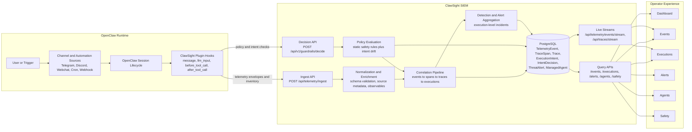

<p align="center">
  <h1 align="center">ClawSight SIEM</h1>
  <p align="center"><strong>Execution-first security and observability for autonomous AI agents.</strong></p>
  <p align="center"><em>Ingest. Correlate. Enforce. Investigate.</em></p>
</p>

<p align="center">
  
  
  
  
  
  
</p>

---

<p align="center">
  <a href="#quick-start">Quick start</a> &middot;
  <a href="#required-configuration">Configuration</a> &middot;
  <a href="#openclaw-plugin-wiring">Plugin wiring</a> &middot;
  <a href="#product-surfaces">Product surfaces</a> &middot;
  <a href="#intent-based-policy-architecture">Intent policy</a> &middot;
  <a href="#api-overview">API</a>
</p>

<p align="center">
  <a href="docs/overview.md">SIEM Overview</a> &middot;
  <a href="docs/architecture.md">Architecture</a> &middot;
  <a href="docs/setup.md">Setup</a> &middot;
  <a href="docs/safety_policy.md">Safety Policy</a> &middot;
  <a href="docs/intent_drift.md">Intent Drift</a>
</p>

---

## What is ClawSight SIEM?

ClawSight SIEM is the control plane for ClawSight EDR agents running on OpenClaw instances. It ingests lifecycle telemetry, correlates activity into executions, applies guardrail decisions, and gives operators a unified interface to investigate behavior and enforce policy.

Core capabilities:
- Ingest normalized telemetry from OpenClaw-integrated plugins.
- Correlate events into execution chains (`Trace` + `TraceSpan` compatibility model).
- Persist unmatched telemetry separately (`TraceOrphan`) for audit integrity.
- Preserve payload evidence server-side while exposing redacted payloads in read APIs.
- Power live operator views across Dashboard, Events, Executions, Alerts, Agents, and Safety.

## Architecture diagram




## Quick start (Docker Compose)

```bash
cp .env.example .env
# edit .env and set a strong POSTGRES_PASSWORD before starting
echo 'SIEM_INGEST_TOKEN=dev-ingest-token' >> .env
echo 'SIEM_ADMIN_TOKEN=dev-admin-token' >> .env
docker compose up --build
```

Default local URL: `http://127.0.0.1:3000`

## Local development (pnpm)

```bash
cd platform
cp .env.example .env
pnpm install
pnpm exec prisma migrate dev
pnpm dev
```

## Required configuration

Set split tokens (recommended):

```bash
echo 'SIEM_INGEST_TOKEN=dev-ingest-token' >> .env
echo 'SIEM_ADMIN_TOKEN=dev-admin-token' >> .env
```

Optional multi-project read scoping:

```bash
echo 'SIEM_PROJECT_TOKENS=default:tenant-default-token,project-a:tenant-a-token' >> .env
```

Notes:
- `SIEM_INGEST_TOKEN`: accepted by plugin-facing endpoints (`/api/telemetry/ingest`, `/v1/guardrails/decide`).
- `SIEM_ADMIN_TOKEN`: required by operator configuration endpoints (`/api/safety/*`, `/api/intent/config`).
- `SIEM_ADMIN_TOKEN`: also required for control-plane server actions in the policy editor (`/policies`, `/policies/:id`) that create/update/delete global rules.
- `SIEM_ADMIN_TOKEN`: also required for prompt-injection policy server actions (`/policies/prompt-injection`) that create/update/delete rules and model settings.
- `SIEM_ADMIN_TOKEN`: also required for alert-triage server actions on `/alerts` and `/alerts/:id` (ack, unack, resolve, false-positive classification updates).
- `SIEM_ADMIN_TOKEN`: also required for safety-page server actions on `/safety` (actions/internet configuration updates).
- `SIEM_ADMIN_TOKEN`: also required for agent-detail server actions on `/agents/:agentKey` (profile edits, scoped-rule create/delete, and hard delete).
- App Router UI rendering is admin-gated; operator page requests must carry a valid admin bearer token (commonly enforced/injected by your reverse proxy access layer).
- Authenticated read APIs (including telemetry, traces, executions, agents, and alerts) require a valid bearer token (admin/shared/tenant token depending on deployment mode).
- Execution risk aggregation and execution-v2 incident dedupe are namespaced by project scope to prevent cross-project collision/contamination in shared-database deployments.
- `SIEM_API_TOKEN` and `CLAWSIGHT_API_TOKEN` remain legacy fallback aliases for compatibility; avoid using them in production.
- `SIEM_DNS_ENRICHMENT_MODE=apex` (default) resolves registrable domains only for DNS enrichment; use `full` only when full-hostname resolution is explicitly required.
- Postgres is not published by default in `docker-compose.yml`. If host access is required, bind explicitly to loopback only (for example `127.0.0.1:5432:5432`), never `0.0.0.0`.

For intent-policy LLM extraction/alignment checks (and optional inbound prompt-injection classification):

```bash
echo 'OPENAI_API_KEY=sk-...' >> .env
```

## OpenClaw plugin wiring

```bash
npx -y @cantinasecurity/clawsight install \
  --mode enforce \
  --platform-url http://127.0.0.1:3000 \
  --token dev-ingest-token \
  --agent-name openclaw-lab-prod \
  --link
```

At startup, plugin emits `agent.bootstrap` and `agent.inventory_snapshot` with:
- stable `agentInstanceId` (persisted locally by plugin)
- mutable `agentName`
- host / OS / runtime metadata
- channels, plugins, and skills inventory snapshot

SIEM upserts `ManagedAgent` from these events.

## Docs

- [`docs/overview.md`](docs/overview.md): page-by-page product behavior and investigation workflow.
- [`docs/architecture.md`](docs/architecture.md): SIEM architecture, ingest/correlation/storage, and system boundaries.
- [`docs/setup.md`](docs/setup.md): plugin + SIEM setup patterns and deployment examples.
- [`docs/safety_policy.md`](docs/safety_policy.md): lifecycle enforcement model for static and intent controls.
- [`docs/intent_drift.md`](docs/intent_drift.md): intent drift model, scoring approach, and current limitations.
- [`docs/api.md`](docs/api.md): all API endpoints with one-line descriptions.
